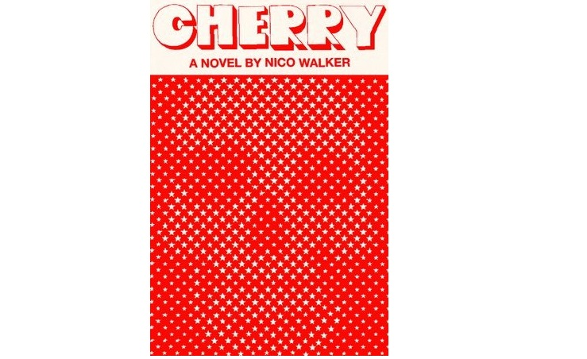

<!-- PELICAN_BEGIN_SUMMARY -->
  

 

Cherry is Nico Walker's debut novel, a fictionalized account of his own life written during his time in prison. It tells the story of a man destroyed by war, coping with his PTSD through drug abuse. And it only goes downhill after that.  

 
  
The movie rights to the novel were recently sold for a million USD to the Russo Brothers' studio. It will reportedly have Tom Holland playing the role of Walker's(?) character.  

 
  
The cover you see on top is the fruit of multitudinous iterations and labour at the hands of Alfred A. Knopf's senior designer, Janet Hansen. Read this hilarious article describing the entire affair on [Literary Hub](https://lithub.com/the-trouble-with-designing-a-book-when-its-author-is-in-jail/).  
<!-- PELICAN_END_SUMMARY -->

 

Here is a code-based attempt at digital art, to recreate the effect of the book cover while replacing the skull motif with one of our choosing. Here, I've chosen one of an emperor butterfly.  

 
  
**Disclaimer: The following code is being published with the requisite permissions from the original designer.**  

 

<!-- TODO: Fix the jupyter notebooks rendering issue -->
  

 
  
Cheers for making it to the end of the code!  

 
  
There's a lot to be improved on here. The original cover used stars, which served the symbolic purpose of representing the stars and stripes, but I have done away with them and replaced them with dots.   

 

Feel free to propose changes to the code and make provisions for using stars or any other symbol.  