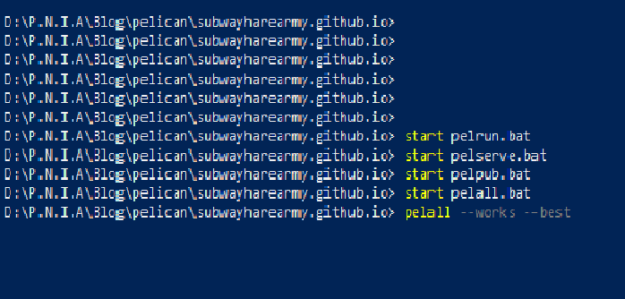

<!-- PELICAN_BEGIN_SUMMARY -->

  

<br>

A first post on how I built this simplistic static blog/personal website using **Pelican** and hosted it on **Github Pages**.

<br>

<!-- PELICAN_END_SUMMARY -->

With my limited proficiency with JavaScript and HTML, I chose Python and Pelican for my personal website. Offering a variety of cleam and minimalistic themes, and plugins, Pelican is a great tool.   

<br>

Now there are a number of good examples to work from and tons of resources to help you build your own blog using Pelican. This post is just to offer some tips to ease the process.   
  
<br>

Windows
==========

<br>

I work with Windows and so it's tricky to get the 'make' command to work. Instead you can use batch files for the same purpose.  

<!-- TODO: fix the css for the code below, it looks absolutely horrendous in light mode -->
- Create the '/output' directory using 'pelrun.bat':
```
$ pelican content --debug --autoreload  --output output --settings pelicanconf.py
``` 
  
- Serve the output HTML code using 'pelserve.bat':
```
$ pushd output
$ python -m pelican.server
$ popd
``` 
Visit [localhost:8000/](http://localhost:8000/) to see the result.  

- Publish the output using 'pelpub.bat':
```
$ pelican content --output output --settings publishconf.py
```   

- To further simplify the process, make a single, all-powerful 'pelall.bat' combining the code from all batch files given above.

<br>

Using Jupyter notebooks in MarkDown articles  
==================

<br>

You might encounter the following error from the 'liquid_tags' plugin while compiling your output:
```
store() got an unexpected keyword argument 'safe'
```

<br>

This is because recent changes made to the libraries have deprecated 'safe'. This can be fixed by forcefully installing an outdated version of nbConvert. Although not a permanent fix, this gets the job done.

<br>

Execute the following code from the command line:
```
$ python -m pip install -U markdown==2.6.11 --force-reinstall
```

<br>

Miscellaneous Tips  
============  

- Add an e-mail subcription list, and automate it with MailChimp. Embed your unique MailChimp URL into your Pelican theme's template to direct your readers to your e-mail subscription list.
- Add your Google Analytics unique ID to monitor visitor activity on your blog.
- Github Pages' Error:404 is quite boring. Make your own hilarious Error:404 redirect webpage.  Check mine out for inspiration.

<br>

Resources  
====

<br>

Apart from the Pelican documentation, these resources are helpful:

|     |    |
| -------- | -------- |
| **My own blog's source** | [Source](https://github.com/subwayHareArmy/subwayHareArmy.github.io/tree/source) |
| **A Windows centric guide** | [Here](https://borzhang.github.io/procedure-of-blogging-with-pelican-and-github-on-windows.html) |
| **danielfrg's theme** | [Here](https://github.com/danielfrg/danielfrg.com) |
| **A well explained guide** | [Here](https://pythonforundergradengineers.com/how-i-built-this-site-1.html) |  

<br>

These will help Windows users to reduce their blog's set-up time and maintenance time.