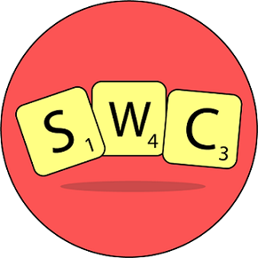

<!-- PELICAN_BEGIN_SUMMARY -->  
  

 

Don't own a Scrabble centric dictionary?

  

Keeping track of Scrabble's rules is hard. Not sure whether proper nouns are allowed or not?

  

Need a quick way to check if you have a legal word, during an important game?

 

[Scrabble Word Checker](https://assistant.google.com/services/a/uid/000000d3fdb78966?hl=en_in) takes care of everything for you.  
Sit back, just ask your Google Assistant on your phone or smart speaker! You can check if a certain word is allowed and you'll get back a tile score as well! 

 

Check it out on ProductHunt!  

 

<!-- PELICAN_END_SUMMARY -->   

Keep [Scrabble Word Checker](https://www.amazon.com/Mandir-Kaha-Banega-Temple-Inquiry/dp/B07TG312YZ) open during your next game of scrabble!      

 

## It checks Scrabble rules

 

Don't worry if you don't remember all the rules, SWC remembers them for you. Ask it if you can use a proper noun:

> User: Ok Google, talk to Scrabble Word Checker 
> SWC: < Greeting Message > 

 
 
> User: Is Nile a valid Scrabble word? 
> SWC: No, Nile is not a valid Scrabble word. 

## It gives you a tile score

 

Get a tile score when you enter a valid word:

> User: Ok Google, talk to Scrabble Word Checker  
> SWC: < Greeting Message >

 
 
> User: Is carrot okay? 
> SWC: Yes, carrot is a valid Scrabble word. You'll get a score of 8 for it. 

## Need some secrecy?

 

Want to check a word, but don't want to say it out loud? SWC's got you. You can type in our query, instead!  

 

Check the Privacy Policy, [here](/pages/google-assistant).
