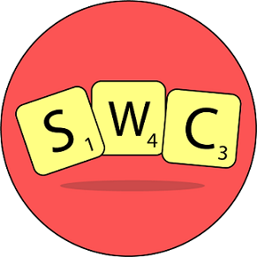

     

 

[**Scrabble Word Checker**](https://assistant.google.com/services/a/uid/000000d3fdb78966?hl=en_in). 

 

Although other solutions for word checking for Scrabble already exist, I found them to be tedious and the UI, inaccesible. I realized that a solution leveraging something approachable like Google Assistant could fill that space, convenient and handy. 

 

Scrabble Word Checker checks relevant Scrabble Dictionaries, compares rules, and return a tile score along with the query. 

 

A quick "Hey, Google. Ask Scrabble Word Checker if 'gullible' is a valid Scrabble word?" is all you need.

 

___________________________________      

   

Privacy Policy for my Google Assistant Actions  
===============================

 

This document serves as the privacy policy and describes how I (Ayush Yembarwar) ["subwayHareArmy", "me" or "I"] protect your ["you", "user" or "customer"] privacy and keep your personal data safe.
Be sure to read this policy as well as Google's [Google Privacy and Terms](https://policies.google.com/privacy?hl=en-in), and [Google Assistant Privacy Settings](https://support.google.com/assistant/answer/7126196?hl=en&ref_topic=7110546).

 

If you use an action, you fully agree to this privacy policy.

General  
-------  

When the user activates an action, their voice input is sent to Google and is processed to realize the user's intent.

 

This data exchange is not avoidable.

Data  
----  

I do not collect any other user data for any Google Assistant Actions.

 

Google's Cloud Functions Console logs data of the form of the frequency of requests and utterances(not tied to a specific user) as a part of their analytics package for improvements.

Changes  
-------  

The Actions and the Privacy Policy might change at a later point of time, as a part of the changes and updates made to the Actions.

 

Your continued use of the Action after changes of the Privacy Policy or the Action itself will be seen as your acceptance of both.
